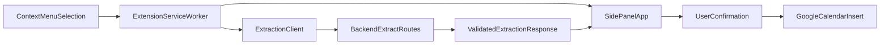

# SnapSort Architecture

## Overview

SnapSort uses a monorepo with a Chrome extension frontend and an Express backend for extraction. The extension owns UX and Google auth/session behavior, while the backend owns AI integration and schema validation.

## Components

- `apps/extension`
  - `background/serviceWorker.ts`: context menu registration and orchestration
  - `content/contentScript.ts`: screenshot flow entrypoint placeholder
  - `sidepanel`: editable event draft UI
  - `options`: persisted user settings
  - `shared`: TypeScript types and Zod schemas for frontend validation/contracts
  - `lib`: storage, extraction API client, messaging, calendar stubs
- `apps/backend`
  - `src/index.ts`: app setup + health endpoint
  - `routes/extractText.ts`: text extraction API
  - `routes/extractImage.ts`: image extraction API
  - `services/llmExtractionService.ts`: extraction service (mock in scaffold)
  - `schemas/eventSchema.ts`: backend request/response validation

## Data Flow

## Security Notes

- LLM keys are backend-only (`apps/backend/.env`).
- AI output is treated as untrusted and validated by Zod.
- Selected text/screenshot logging should be removed in production telemetry.
- Event creation always requires explicit user confirmation.
